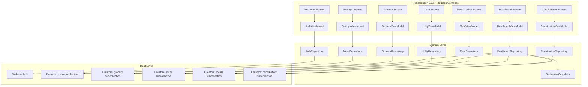
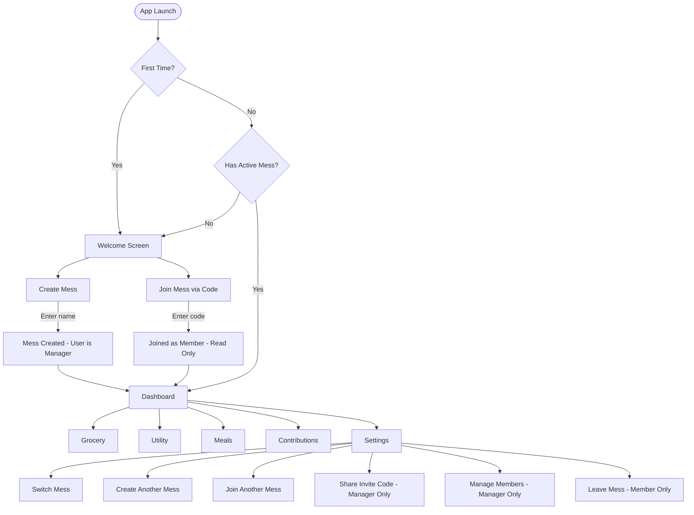
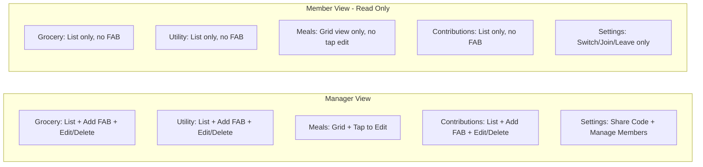

# Architecture Document
# Mess Management System — Android App

---

## 1. Tech Stack Selection

| Layer | Technology | Justification |
|-------|-----------|---------------|
| **Language** | Kotlin | Official Android language. Null-safe, coroutine support. |
| **UI Framework** | Jetpack Compose | Modern declarative UI. Faster dev than XML layouts. |
| **Architecture** | MVVM | Google-recommended. Clean separation, lifecycle-aware. |
| **Local Cache** | Room (SQLite) | Offline caching of Firestore data. Fast reads. |
| **Cloud Database** | Firebase Firestore | Real-time NoSQL sync. Manager writes, members read live. |
| **Authentication** | Firebase Google Sign-In | One-tap login. Account survives uninstall, works across devices. |
| **Push Notifications** | Firebase Cloud Messaging (FCM) | Personalized notifications to each member when manager updates data. |
| **Backend Logic** | Firebase Cloud Functions | Triggers on Firestore writes to send targeted FCM notifications. |
| **DI** | Hilt | Official Android DI. Simplifies injection. |
| **Navigation** | Navigation Compose | Type-safe screen navigation with arguments. |
| **State** | StateFlow + Compose State | Reactive, lifecycle-aware state management. |
| **Date/Time** | java.time (desugared) | Modern date API, backported to older SDKs. |
| **Build** | Gradle (Kotlin DSL) | Standard with version catalogs. |
| **CI/CD** | GitHub Actions | Auto-build APK on push, upload to GitHub Releases. |
| **Auto-Update** | GitHub Releases API | App checks for new versions on launch, prompts user to update. |
| **Min SDK** | API 24 | Covers 97%+ active devices. |
| **Target SDK** | API 35 | Latest stable. |

---

## 2. System Architecture Diagram



---

## 3. User Flow Diagram



### Role-Based UI Behavior



---

## 4. Directory Structure

```
app/src/main/java/com/messmanager/app/
├── di/                          # Hilt Modules
│   ├── AppModule.kt
│   ├── DatabaseModule.kt
│   └── FirebaseModule.kt
├── data/
│   ├── local/
│   │   ├── MessLocalDatabase.kt
│   │   ├── dao/                 # Room DAOs (local cache)
│   │   └── entity/              # Room Entities (local cache)
│   ├── remote/
│   │   ├── FirestoreDataSource.kt
│   │   └── model/               # Firestore document models
│   │       ├── MessDocument.kt
│   │       ├── GroceryDocument.kt
│   │       ├── UtilityDocument.kt
│   │       ├── MealDocument.kt
│   │       ├── ContributionDocument.kt
│   │       └── UserDocument.kt
│   └── repository/
│       ├── AuthRepository.kt
│       ├── MessRepository.kt
│       ├── GroceryRepository.kt
│       ├── UtilityRepository.kt
│       ├── MealRepository.kt
│       ├── ContributionRepository.kt
│       └── DashboardRepository.kt
├── domain/
│   ├── model/                   # Domain Models
│   │   ├── User.kt
│   │   ├── Mess.kt
│   │   ├── MessRole.kt          # enum: MANAGER, MEMBER
│   │   ├── Grocery.kt
│   │   ├── Utility.kt
│   │   ├── Meal.kt
│   │   ├── Contribution.kt
│   │   ├── Member.kt
│   │   ├── MealRate.kt
│   │   └── Settlement.kt
│   └── calculator/
│       └── SettlementCalculator.kt
├── ui/
│   ├── theme/                   # Color.kt, Type.kt, Shape.kt, Theme.kt
│   ├── navigation/              # NavGraph.kt, Screen.kt
│   ├── components/              # Reusable: TopBar, BottomNav, SummaryCard, etc.
│   ├── welcome/                 # WelcomeScreen.kt, CreateMessScreen.kt, JoinMessScreen.kt
│   ├── dashboard/               # DashboardScreen.kt, DashboardViewModel.kt
│   ├── grocery/                 # GroceryScreen.kt, GroceryFormDialog.kt, GroceryViewModel.kt
│   ├── utility/                 # UtilityScreen.kt, UtilityFormDialog.kt, UtilityViewModel.kt
│   ├── meal/                    # MealTrackerScreen.kt, MealCalendarGrid.kt, MealViewModel.kt
│   ├── contribution/            # ContributionScreen.kt, ContributionFormDialog.kt, ContributionViewModel.kt
│   └── settings/                # SettingsScreen.kt, SettingsViewModel.kt
├── util/
│   ├── CurrencyFormatter.kt
│   ├── DateUtils.kt
│   ├── InviteCodeGenerator.kt
│   └── Constants.kt
├── MessApplication.kt
└── MainActivity.kt
```

---

## 5. Firestore Data Model

### 5.1 Collection: `users`
Each document = one app user (created on Google Sign-In).

| Field | Type | Description |
|-------|------|-------------|
| `uid` | string | Firebase Auth UID (document ID) |
| `displayName` | string | User's display name |
| `createdAt` | timestamp | Account creation time |
| `messes` | array of maps | List of `{ messId, role, joinedAt }` |

### 5.2 Collection: `messes`
Each document = one mess for **one specific month**.

| Field | Type | Description |
|-------|------|-------------|
| `id` | string | Auto-generated document ID |
| `name` | string | Mess name (e.g., "Mirpur Mess") |
| `month` | number | Month number (1-12, e.g., 8 = August) |
| `year` | number | Year (e.g., 2026) |
| `inviteCode` | string | Unique 6-char code (e.g., `X7K9M2`) |
| `managerId` | string | UID of the current manager (can be transferred) |
| `creatorId` | string | UID of the original creator |
| `memberIds` | array of string | UIDs of all members (including manager) |
| `members` | array of maps | `{ uid, name, isActive, joinedAt }` |
| `createdAt` | timestamp | Mess creation time |

### 5.3 Subcollection: `messes/{messId}/grocery_entries`
| Field | Type | Description |
|-------|------|-------------|
| `id` | string | Auto-generated |
| `date` | string | Purchase date (ISO) |
| `itemName` | string | Item name |
| `unit` | string | kg, pcs, liters |
| `quantity` | number | Quantity |
| `costBdt` | number | Cost in paisa (integer) |
| `notes` | string | Optional |
| `month` | number | 1-12 |
| `year` | number | Year |
| `createdBy` | string | Manager UID |
| `createdAt` | timestamp | Entry creation time |

### 5.4 Subcollection: `messes/{messId}/utility_entries`
| Field | Type | Description |
|-------|------|-------------|
| `id` | string | Auto-generated |
| `category` | string | RENT, WATER, WASTE, TRANSPORT, SUPPLIES, OTHER |
| `description` | string | Bill description |
| `costBdt` | number | Cost in paisa |
| `notes` | string | Optional |
| `month` | number | Month |
| `year` | number | Year |
| `createdBy` | string | Manager UID |
| `createdAt` | timestamp | Entry time |

### 5.5 Subcollection: `messes/{messId}/meal_entries`
| Field | Type | Description |
|-------|------|-------------|
| `id` | string | Document ID = `{memberUid}_{date}` |
| `memberUid` | string | Member's UID |
| `memberName` | string | Member's display name (denormalized) |
| `date` | string | Day (ISO) |
| `mealCount` | number | Float (e.g., 0, 0.5, 1, 1.5, 2, 2.5, 3) |
| `month` | number | Month |
| `year` | number | Year |

### 5.6 Subcollection: `messes/{messId}/contribution_entries`
| Field | Type | Description |
|-------|------|-------------|
| `id` | string | Auto-generated |
| `memberUid` | string | Contributor UID |
| `memberName` | string | Contributor name (denormalized) |
| `amountBdt` | number | Amount in paisa |
| `date` | string | Contribution date |
| `purpose` | string | Purpose note |
| `month` | number | Month |
| `year` | number | Year |
| `createdBy` | string | Manager UID |
| `createdAt` | timestamp | Entry time |

### 5.7 Subcollection: `messes/{messId}/borrow_requests`
Each document = one borrow request. **No financial impact — item return only.**

| Field | Type | Description |
|-------|------|-------------|
| `id` | string | Auto-generated document ID |
| `requesterUid` | string | Member who borrowed |
| `requesterName` | string | Member name (denormalized) |
| `itemName` | string | What was borrowed (e.g., "Eggs") |
| `quantity` | string | How much (e.g., "4 pcs") |
| `status` | string | `pending` / `accepted` / `rejected` / `returned` |
| `date` | string | Date of borrowing |
| `dueDate` | string | Manager sets this on approval — return deadline |
| `createdAt` | timestamp | Request time |
| `resolvedAt` | timestamp | When manager accepted/rejected |
| `returnedAt` | timestamp | When manager marked as returned |

### 5.7 ER Diagram

```mermaid
erDiagram
    USERS ||--o{ MESSES : "creates/joins"
    MESSES ||--o{ GROCERY_ENTRIES : "has"
    MESSES ||--o{ UTILITY_ENTRIES : "has"
    MESSES ||--o{ MEAL_ENTRIES : "has"
    MESSES ||--o{ CONTRIBUTION_ENTRIES : "has"
    MESSES ||--o{ BORROW_REQUESTS : "has"
    
    USERS { string uid PK; string displayName; array messes }
    MESSES { string id PK; string name; string inviteCode; string managerId; array memberIds }
    GROCERY_ENTRIES { string id PK; string date; string itemName; number costBdt; number month; number year }
    UTILITY_ENTRIES { string id PK; string category; number costBdt; number month; number year }
    MEAL_ENTRIES { string id PK; string memberUid; number mealCount; number month; number year }
    CONTRIBUTION_ENTRIES { string id PK; string memberUid; number amountBdt; number month; number year }
    BORROW_REQUESTS { string id PK; string requesterUid; string itemName; number finalCostBdt; string status }
```

### 5.8 Firestore Security Rules (Concept)

```
rules_version = '2';
service cloud.firestore {
  match /databases/{database}/documents {
    // Users can only read/write their own user document
    match /users/{userId} {
      allow read, write: if request.auth.uid == userId;
    }
    
    // Mess document: readable by members, writable by manager
    match /messes/{messId} {
      allow read: if request.auth.uid in resource.data.memberIds;
      allow create: if request.auth != null;
      allow update, delete: if request.auth.uid == resource.data.managerId;
      
      // Subcollections (grocery, utility, meals, contributions): manager only
      match /{subcollection}/{docId} {
        allow read: if request.auth.uid in get(/databases/$(database)/documents/messes/$(messId)).data.memberIds;
        allow write: if subcollection != 'borrow_requests'
                     && request.auth.uid == get(/databases/$(database)/documents/messes/$(messId)).data.managerId;
      }
      
      // Borrow requests: members can CREATE, manager can UPDATE/DELETE (accept/reject)
      match /borrow_requests/{requestId} {
        allow read: if request.auth.uid in get(/databases/$(database)/documents/messes/$(messId)).data.memberIds;
        allow create: if request.auth.uid in get(/databases/$(database)/documents/messes/$(messId)).data.memberIds;
        allow update, delete: if request.auth.uid == get(/databases/$(database)/documents/messes/$(messId)).data.managerId;
      }
    }
    
    // Allow looking up mess by invite code (for joining)
    match /messes/{messId} {
      allow list: if request.auth != null 
                  && request.query.limit == 1;
    }
  }
}
```

### 5.9 Settlement Calculation (unchanged)

```
mealRate         = totalGrocery / totalMeals
utilityPerMember = totalUtility / activeMembers

FOR each member:
    groceryCost  = memberMeals × mealRate
    utilityCost  = utilityPerMember
    totalCost    = groceryCost + utilityCost
    balance      = contribution - totalCost
    → Positive: "GET BACK BDT X"
    → Negative: "PAY EXTRA BDT Y"
    → Zero:     "SETTLED"
```

---

## 6. Invite Code System

### Code Generation
- **Format**: 6-character alphanumeric, uppercase (e.g., `X7K9M2`)
- **Character set**: `A-Z, 0-9` excluding confusable characters (`O, 0, I, 1, L`) → `ABCDEFGHJKMNPQRSTUVWXYZ23456789`
- **Uniqueness**: Checked against Firestore `messes` collection before assignment
- **Generated**: Once at mess creation time, stored in mess document

### Join Flow
1. User enters 6-char code
2. App queries Firestore: `messes WHERE inviteCode == code`
3. If found → show mess name, confirm join
4. Add user's UID to `memberIds` array
5. Add mess reference to user's `messes` array
6. Navigate to mess Dashboard (read-only)

---
